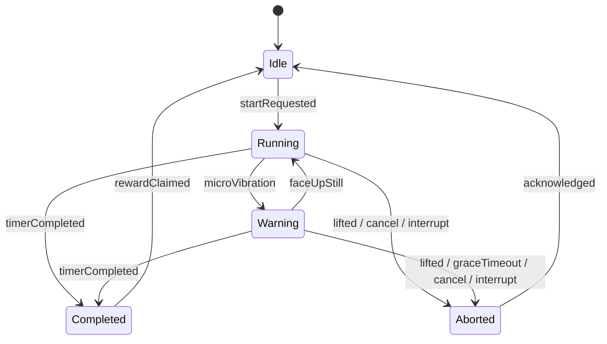
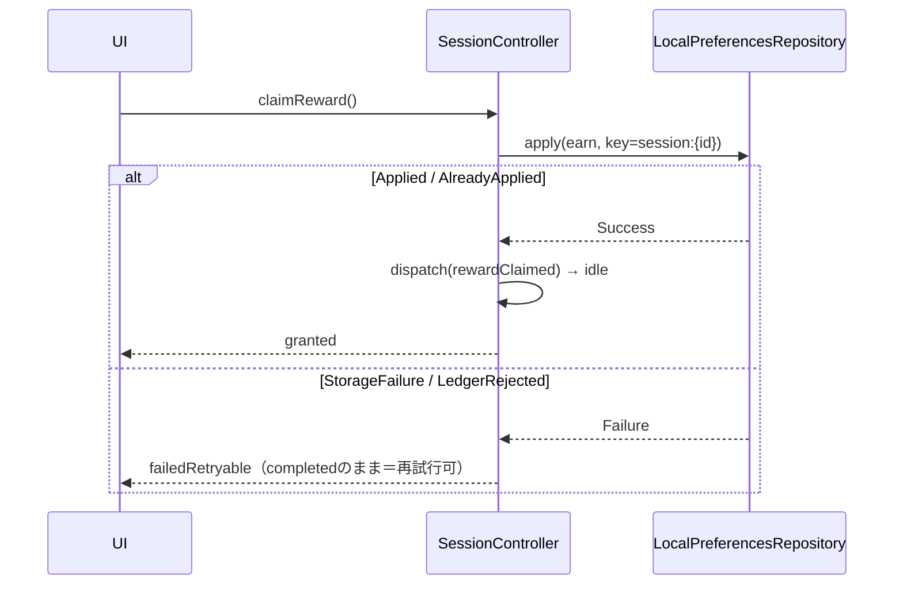
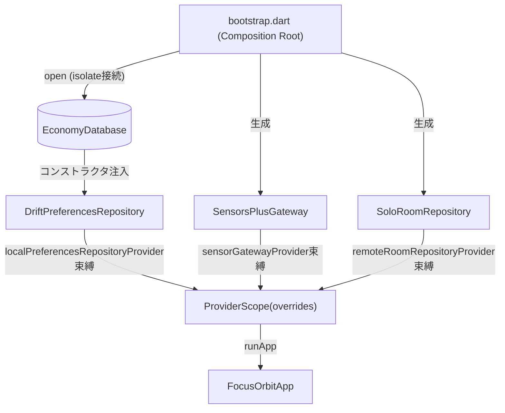

# Focus Orbit — Architecture v2.0（Phase 2 完了時点 / verified 2026-07-07）

センサー駆動の集中アプリ「Focus Orbit」のドメイン・状態管理・ローカル永続化・UI基盤コード一式。
スタックは Flutter/Dart + Riverpod 3 + freezed 3 + drift 2.31（実装済み）+ AWS Amplify Gen 2 / AppSync（Phase 4 で実装）。
本書は次フェーズ実装者（人間またはAIエージェント）がゼロコンテキストで再開するための唯一の正。
改訂履歴: v1.x = Phase 0 設計書 → v2.0 = Phase 1（テスト基盤・112件）/ Phase 2（drift 永続化層・+18件）完了を反映、§12 LANDMINE 登記簿を新設、§13 に Phase 3 DI 設計を追加。

## 1. Prerequisites（pubspec.yaml と一致・2026-07-07 突合済み）

| 要件 | 値 | 備考 |
|---|---|---|
| Dart SDK | **^3.10.0** | T13確定: test / drift_dev / amplify の三すくみの解は 3.10 床（pub get ログで証明） |
| Flutter | Dart 3.10 同梱の stable | |
| flutter_riverpod | ^3.3.1 | AD-1。`Override` は misc.dart へ移動（LANDMINE ⑨） |
| freezed_annotation | ^3.1.0 | AD-2 |
| drift | **2.31.0（完全固定）** | AD-3。**2.32+ は sqlite3 ^3.x 要求で drift_flutter 0.2系と非互換、2.33+ は SDK>=3.10 要求**（実測）。drift_dev とロックステップ（⑮） |
| drift_flutter | **0.2.8（完全固定）** | AD-3。sqlite3 ^2.x 系。drift 2.31 系と同一 sqlite3 宇宙 |
| sqlite3 | **2.9.4（lock実値の報告で最終確定・PENDING-INPUT）** | AD-3/P2-T1。`SqliteException` 型判定（UNIQUE違反→AlreadyApplied）。**注意: drift_dev 2.31 の床は ^2.4.6 — 2.4.0固定は解決不能（⑮で実証）** |
| sensors_plus | ^7.0.0 | AD-4 |
| amplify_flutter / api / auth_cognito | ^2.11.0 | AD-5。ロックステップ配信（amplify_core >=2.11.0 <2.12.0） |
| build_runner (dev) | ^2.15.0 | |
| freezed (dev) | ^3.2.5 | 4.0.0 は dev prerelease のみ（2026-07 時点） |
| drift_dev (dev) | **2.31.0（完全固定）** | drift とロックステップ（⑮）。**キャレット表記は禁止 — `^2.31.0` が 2.34 へ浮上し build_runner の AOT コンパイル失敗を起こした（2026-07-07 実測）** |

`dependency_overrides` は禁止。**pubspec.lock は必ずリポジトリにコミットする**（キャレット範囲内の無言浮上を `pub upgrade` 実行時のみに限定するため — 未コミットが3件の依存事故の共通因子だった）。バージョン変更は必ず pub.dev 一次確認＋pub get ログの証拠を添えて本表と pubspec と lock を同時更新すること（片方だけの更新は DOC-CODE-MISMATCH）。

UNVERIFIED: 0件。旧 v1.x の記載（Dart ^3.8 / drift ^2.34 / riverpod ^3.2）は Phase 1 T13 の依存解決で上表に置換済み。

### §6追補（P1-T9 検証結果・AWS 公式 docs 一次確認）— Phase 4 実装を拘束

- TTL属性: **Number型・Unixエポック秒**（ミリ秒不可・非Number型は無視される）。
- TTL削除は**ベストエフォートで「数日以内」**。期限切れ未削除の項目は**read/Query/Scanに現れ続ける**ため、公式推奨に従いクエリ側で `expiresAt > now` のフィルタ式が**必須**。
- 帰結（設計規則T9-R1）: **TTLはガベージコレクションであり、生存判定ではない**。occupantCount/activeCountを算出するAppSyncリゾルバは必ずexpiresAtフィルタを適用し、ハートビート(reportActive/watch維持)がexpiresAtを短周期(推奨90-120秒)で更新する。エッジ#4(ghost membership)の即時性はフィルタが担い、TTLはストレージ掃除のみを担う。
- Amplify Flutter Subscription（AD-5前提の裏取り）: WebSocket自動再接続は指数バックオフ内蔵（既定8回/約50秒、RetryOptionsで調整可）。接続状態はAmplify Hub(HubChannel.Api/SubscriptionHubEvent)で観測可能。**オフライン中のメッセージは失われ自動追い付きしない**（公式明記）→ watch契約(2)「再接続時スナップショット再取得」は必須条項として正当。リトライ上限到達=ソケット閉鎖はエッジ#3(soloFallback)へ写像する。

## 2. Quickstart（Phase 2 完了時点・実行済み）

作業ディレクトリ: リポジトリルート。

1. `flutter pub get` — 期待出力: `Got dependencies!`
2. `dart run build_runner build --delete-conflicting-outputs` — 期待出力: `*.freezed.dart` 15 個＋drift 生成物（`economy_database.g.dart` ほか）が生成され `Succeeded`
3. `flutter analyze` — 期待出力: `No issues found!`
4. `flutter test` — 期待出力: `+131: All tests passed!`

状態: **DONE（2026-07-07・開発機ローカルで全4手順 GREEN 確認済み。131 = P1 の 112 + P2 の drift リポジトリ 18 + P3 の結線 smoke 1）**。
生成ファイル（`*.freezed.dart` / `*.g.dart`）はリポジトリ非管理。手順2を飛ばすと全 freezed/drift ファイルが `part` 未解決でエラーになるのは正常（LANDMINE ①）。

## 3. ディレクトリと依存方向（ツリー v2.0 = Phase 2 実装後の現物）

```
lib/
├── main.dart                                 # P3-T1で実装（現状スタブ）
├── main_sensor_debug.dart                    # センサー実機検証用エントリ
├── app/
│   ├── bootstrap.dart                        # Composition Root（P3-T1で実装）
│   ├── di.dart                               # buildOverrides（束縛点・実装済み）
│   └── presentation/fo_theme.dart            # デザイントークン（色はRenderParams駆動）
├── core/domain/{ids,sync_mode,result,app_failure}.dart
├── core/application/clock.dart               # D20: 時刻注入点（riverpodのみ依存可）
└── features/
    ├── stance/   domain{device_stance, motion_sample, stance_thresholds,
    │             sensor_gateway, stance_detector}
    │             + application{stance_providers, stance_debug_providers}
    │             + data/sensors_plus_gateway.dart            # AD-4実装済み
    │             + presentation/sensor_debug_view.dart
    ├── session/  domain{session_phase, focus_session, session_transition, view_mode}
    │             + application{session_controller, view_mode_controller}
    │             + presentation/focus_view.dart
    ├── motif/    domain{motif_skin, render_params, bgm_preset, motif_catalog, motifs/*}
    │             + application/selected_motif_controller.dart
    ├── economy/  domain{wallet, coin_transaction, unlock_state, economy_ledger,
    │             user_settings, local_preferences_repository}
    │             + application{economy_providers, shop_controller}
    │             + data/drift/{economy_database, economy_database_connection,
    │               drift_preferences_repository}              # P2-T1実装済み（§7）
    │             + presentation/shop_view.dart
    └── presence/ domain{room_presence, presence_connection_state, remote_room_repository}
                  + data/solo_room_repository                  # watch契約の参照実装
                  + application/presence_providers
test/
├── widget_test.dart                          # 結線smoke(P3-T3a)。buildOverrides経由の起動固定
└── features/{stance,session,economy}/...     # 4ファイル・実行時130件（合計131・§10）
```

依存規則（grep検証・§10）:
- domain → `dart:` / `freezed_annotation` / 自パッケージdomainのみ（D5）。riverpod・SDK混入 0件。
- 許可済みdomain間エッジは2本のみ（D9 v1.1）: `session→stance`（イベントペイロード）、`economy→motif`（ID・価格）。
- application → domain + riverpod。data → domain + SDK（drift/sqlite3/sensors_plus は data 層のみ）。
- 実装型（`Drift*` / `SensorsPlus*` / `Solo*`）へのコード参照が許されるのは `data/` 自身・`app/bootstrap.dart`・`main_sensor_debug.dart`・テストのみ（詳細は §13 疎結合ゲート）。

Phase 4 で追加する data 実装: `presence/data/appsync_room_repository.dart`（§6 契約）。

## 4. セッション状態機械（T0-A3 v1.1 = session_transition.dart が実装）

| 現在 | イベント | 次 | 副作用（SessionEffect） |
|---|---|---|---|
| idle | startRequested | running | StartSessionTimer (+multi: JoinPresence) |
| running | stance→microVibration | warning | StartGraceTimer |
| warning | stance→faceUpStill | running | CancelGraceTimer |
| running/warning | stance→lifted | aborted(pickedUp) | StopAllTimers (+multi: LeavePresence) |
| warning | graceTimeout | aborted(graceTimeout) | 同上 |
| running | graceTimeout(stale) | running | —（レース無害化） |
| running/warning | userCancelled / systemInterrupted | aborted(...) | 同上 |
| running/warning | timerCompleted(coins) | completed(coins) | StopAllTimers (+multi: LeavePresence) |
| completed | rewardClaimed | idle | GrantReward（実付与はD16で先行コミット済み） |
| aborted | acknowledged | idle | — |
| 非アクティブ | stanceChanged | 不変 | —（D8） |
| 上記以外 | * | Rejected | debugでassert表面化 |



ViewModeはSessionPhaseと直交（D2）。切替可否は `ViewModePolicy.canToggle`（running/warningのみtrue）。
本表はテスト側にも「手書きの二重転記」として存在する（session_transition_test.dart の35行スイープ）。表を変更する場合は実装・本書・テスト表の3点を同時更新すること。

## 5. 報酬の整合性（コインは二重付与も消失もしない）



根拠: D16（効果先行コミット: 付与成功後にのみidle遷移）× T6（決定的idempotencyKey）× T7（DB UNIQUE制約が真実、事前チェック依存の禁止）。二重タップはAlreadyApplied+phase再確認で吸収。
Phase 2 追記: T7 の「真実」は §7 の drift DDL として実装済み。UNIQUE 違反は `SqliteException`（拡張コード 2067 = SQLITE_CONSTRAINT_UNIQUE）の型付き捕捉で `AlreadyApplied` に写像される（文字列 message 判定は禁止・LANDMINE 登記簿参照）。

## 6. RemoteRoomRepository 契約（presence, Phase 4 = AppSync）

操作と認可（Cognito guest identity）:

| 操作 | 種別 | べき等 | 認可 |
|---|---|---|---|
| joinRoom(roomId) | mutation | ○（自メンバー行upsert） | 自分のmembership行のみ書込 |
| leaveRoom() | mutation | ○ | 同上 |
| heartbeat() / setActive(bool) | mutation | ○（上書き） | 同上 |
| roomPresence(roomId) | query | — | 集計値のみ読取（PIIなし） |
| onRoomPresenceChanged(roomId) | subscription | — | 同上 |

失敗モード登録簿（実装は各行を満たすこと）:

| # | ケース | 契約上の帰結 |
|---|---|---|
| 1 | オフラインでjoin | Failure(PresenceNetworkUnavailable)、セッションはローカル継続（D4） |
| 2 | 購読中の切断→復帰 | connected→reconnecting→connected、復帰時スナップショット再取得必須（オフライン中のsubscriptionメッセージは失われるため） |
| 3 | 再接続リトライ尽き | reconnecting→soloFallback（watchは沈黙、セッション非影響） |
| 4 | join後のアプリkill | leave不達→DynamoDB TTL失効で自動退室（leaveはbest-effort） |
| 5 | 二重join | upsertでoccupantCount不変 |
| 6 | stale presence | TTL結果整合、RoomPresence.asOfで鮮度提示 |
| 7 | guestトークン失効 | Failure(PresenceUnauthorized)、再認証はapp層 |

watch契約: (1) listen直後に必ずスナップショット1件 (2) 再接続成功時もスナップショット再取得 (3) エラーはStreamエラーにせずconnectionState側のデータとして表現。SoloRoomRepository（実装済み・Phase 3 MVPで結線）が契約の参照実装。roomIdの導出はD19（部屋=モチーフ、`RoomId(motifId.value)`）。

## 7. LocalPreferencesRepository スキーマ契約（Phase 2 で drift 実装済み）

| テーブル | PK | DBで強制する不変条件 |
|---|---|---|
| coin_transactions | id autoinc | UNIQUE(idempotency_key) / CHECK(amount > 0) / type NOT NULL / CHECK(type⇔motif_id 整合: earn は NULL・spend_unlock は非NULL) |
| wallet_snapshot | 単一行(id=1, CHECK(id=1)) | CHECK(balance >= 0) |
| user_settings | 単一行(id=1, CHECK(id=1)) | 全列NOT NULL |

実装対応（P2-T1、テスト18件で契約固定）:

| 契約 | 実装ファイル | 実装点 |
|---|---|---|
| DDL＋第三層防御 | `economy/data/drift/economy_database.dart` | (1)ドメイン検証 (2)台帳検証 が破れても (3)DB制約 が INSERT/UPDATE を拒否 |
| 接続ファクトリ | `economy/data/drift/economy_database_connection.dart` | drift_flutter によるバックグラウンド isolate 接続 |
| リポジトリ契約 | `economy/data/drift/drift_preferences_repository.dart` | apply/watch/リプレイ射影の全メソッド |

- D14: 解放状態と残高は台帳からの射影。`解放済み = {価格0のカタログ品} ∪ {spendUnlock行のmotifId}`。snapshotはキャッシュで、台帳INSERTと同一トランザクションで更新。
- apply()の失敗分類: StorageIoFailure / StorageCorrupted / StorageMigrationFailed。UNIQUE 違反は失敗ではなく **AlreadyApplied**（`SqliteException` 拡張コード 2067 / 一次コード 19 で型判定）。リプレイ中に AlreadyApplied / LedgerRejected が出た場合のみ StorageCorrupted（INSERT時検証済み行が壊れている証拠）。初回起動はEconomyState.initial()（失敗ではない）。
- 単一行テーブルの Companion は `id: const Value(1)` で明示指定する（LANDMINE ⑫）。
- 時刻はUTCエポックms、コインはint（整数単位通貨）。マイグレーションはdriftスキーマステップ、台帳テーブルへの破壊的変更は禁止。

## 8. ADR要約（T1、全パッケージ2026-07に一次ソース検証済み）

| # | 決定 | 理由（1行） | 却下 |
|---|---|---|---|
| AD-1 | Riverpod 3 | Stream合成の宣言性・autoDispose・ref.mounted・ProviderContainerテスト | bloc / GetX / StateNotifier |
| AD-2 | freezed 3 + sealed | exhaustive switchで遷移漏れをコンパイルエラー化 | 手書きimmutable |
| AD-3 | drift（+ sqlite3 直依存） | 台帳のトランザクション原子性＋リアクティブSELECT。sqlite3 は `SqliteException` の型付き制約違反判定のため直依存（P2-T1） | shared_preferences / Hive |
| AD-4 | sensors_plus 7 | 2系統（重力込み=姿勢 / 除去=振動量）のStream API | 生platform channel |
| AD-5 | Amplify Gen2 + AppSync Subscription + DynamoDB TTL + Cognito guest | subscribeがStreamを返す・再接続バックオフ内蔵。欠落メッセージは再接続時スナップショット再取得で補償 | AppSync Events API（Flutter対応未確認のため） |
| AD-6 | rxdart不採用 | 必要演算3種は純Dartで足り依存最小化 | rxdart |

## 9. 決定ログ D1–D22

D1 微振動は即failでなくwarning+猶予 / D2 ViewModeはPhaseと直交・アクティブ中のみ切替 / D3 background・着信=systemInterrupted / D4 接続断でもセッション継続・presenceのみデグレード / D5 domain層import白リスト / D6 MotifCatalogは静的定義 / D7 報酬額はイベントペイロード注入 / D8 非アクティブ中のstanceはno-op / D9(v1.1) domain間エッジはsession→stanceとeconomy→motifのみ / D10 水=価格0初期解放 / D11 カタログ検証はShopController / D12 tickは遷移でなくcopyWith / D13 UserSettingsは最小構成（閾値永続化はdrift user_settingsで実装済み） / D14 残高・解放は台帳射影 / D15 SessionIdはローカル一意で十分 / D16 報酬は効果先行コミット / D17 猶予10秒（注入可） / D18 1分=1コイン（暫定） / D19 部屋=モチーフ単位 / D20 時刻はclockProvider注入 / **D21**(P2) DB制約違反は例外messageの文字列一致でなく `SqliteException` の拡張コード（2067等）で型判定する / **D22**(P2) DB制約はドメイン・台帳検証に続く第三層防御であり、テストは制約自体を `customStatement` で直接叩いて固定する。

## 10. 検証状態（2026-07-07）

実行検証（開発機・全合格・2026-07-07更新）: `flutter analyze` 0件 / `flutter test` **131件 GREEN**（stance_detector 22 / session_transition 71=静的14+表駆動57 / economy_ledger 19 / drift_preferences_repository 18 / 結線smoke 1）。
機械検証（grep・全合格）: UIimport 0 / domain層riverpod混入 0 / D5違反import 0 / SDK直import（data層以外）0 / @freezed 15ファイル⇔part宣言一致 / TODO残存 0 / SessionEffect 7種⇔executor分岐 7 / idempotencyキー書式 両側一致 / Companion への生 int PK リテラル 0（LANDMINE ⑫ 回帰grep）。
未検証（Phase 3 で実施）: 実機/エミュレータでの初回フレーム到達（P3-T1 の残余検証・P3-T2 冒頭で消化）、実機センサー閾値キャリブレーション（LANDMINE ③）。
未検証（Phase 4 で実施）: Amplify Subscriptionの実挙動（§6契約）。

## 11. ハンドオフカプセル

- **DONE:**
  - Phase 0 = T0–T10（設計・ドメイン・状態管理層。証拠: §10 機械検証）。
  - Phase 1 = 依存解決（T13: Dart 3.10床・§1確定）/ テスト基盤 112件 GREEN / SensorsPlusGateway / presentation 骨格 / SoloRoomRepository。
  - Phase 2 = P2-T1 drift 永続化層（§7 の3ファイル+テスト18件）/ P2-T2 analyze 0件・**130/130 GREEN**（2026-07-07 ローカル実行）。
- Phase 3（進行中）= P3-T0 文書同期 DONE / P3-T1 DI結線 実装DONE（bootstrap・main・FocusOrbitApp。analyze 0件・131 GREEN。**残余検証: 実機初回フレームのみ**）/ P3-T3a 結線smoke DONE（widget_test.dart 1件、`flutter create .` テンプレート混入障害からの転用 → LANDMINE ⑭）。
- **IN-FLIGHT:** **PENDING-INPUT**: iOSビルド障害（connectivity_plus/Xcode・LANDMINE ⑬）への適用解が未報告（候補: amplify_* 一時除去 or dependency_overrides）。pubspec 現物の確認結果で §1 を確定させること — それまで §1 の amplify 3行は「要現物確認」扱い。
- **NEXT（Phase 3 残、依存順）:** (1) P3-T1b ショップ導線 = idle画面から `FocusOrbitApp.shopRoute` への遷移UI（done: タップでShopView表示・analyze 0・131 GREEN） (2) P3-T2 ソロMVP統合検証 = 実機初回フレーム（T1残余）＋§4ק5全旅程E2E＋kill-restartべき等性観測 (3) P3-T3b 請求リトライ経路の回帰テスト = **実装済み（session_controller_claim_test.dart・4件）・検証待ち（期待: 131+4=135 GREEN）** (4) P3-T4 カプセル更新・§1確定（PENDING-INPUT解消）・Phase 4引き継ぎ（先頭に P4-T0 環境ゲート: Xcode 26系更新）。
- **LANDMINES:** §12 登記簿が正（本節には複製しない）。
- **FILES:** §3ツリー＝path→role対応表。正はコード、本書はその写像（食い違い時はDOC-CODE-MISMATCHとしてコードが勝つ）。

## 12. LANDMINE 登記簿（v2.0 で新設・唯一の正）

状態区分: **恒久ルール**=今後も常に拘束 / **解消済み**=コード修正完了・回帰テストor grepで固定 / **未解消**=対応フェーズ明記 / **P4拘束**=AppSync実装時に効く設計規則。

| # | 内容 | 状態 | 発見 | 固定方法 |
|---|---|---|---|---|
| ① | build_runner未実行だと全freezed/driftファイルが赤（正常） | 恒久ルール | P0 | §2 手順2 |
| ② | freezedにfromJson未定義=永続化はdriftマッパー側で明示変換 | 恒久ルール（実装済み） | P0 | drift_preferences_repository の明示マッパー＋往復テスト |
| ③ | sensors_plusのz軸符号・座標系は端末により要検証 | **未解消（P3-T2 実機で）** | P0 | main_sensor_debug.dart で観測→キャリブレーションで吸収 |
| ④ | economyStateProviderはkeepAlive（リポジトリ=アプリ寿命） | 恒久ルール | P0 | §13 所有権規則。**P3-T1 で直撃するため要注意** |
| ⑤ | start()を非idleで呼ぶとdebugビルドはassertで停止（仕様） | 恒久ルール | P0 | session_transition テスト（Rejected 表） |
| ⑥ | `const {}` は空Map推論になる→ `const <String>{}` と書く | 解消済み | P0 | コード修正済み |
| ⑦ | TTLだけに退室を頼るとghost滞在者が数日残る — リゾルバのexpiresAtフィルタが生存判定の正 | **P4拘束**（P1-T9で一次検証済み） | P1 | §1追補 T9-R1。AppSyncリゾルバ実装のレビューゲート |
| ⑧ | Amplify subscriptionはバックグラウンド復帰後connected表示のまま沈黙する既知報告(amplify-flutter#3865)。本アプリはD3でバックグラウンド=中断のため影響限定的だが、復帰時は新規join+スナップショット再入室を維持 | **P4拘束**（P1-T9で一次検証済み） | P1 | §6 watch契約(2) |
| ⑨ | Riverpod 3 で `Override` 型は本体exportからmisc.dartへ移動。`import 'package:flutter_riverpod/misc.dart' show Override` が正（本体importは unused_import になる） | 解消済み・恒久ルール | P1 | app/di.dart 冒頭コメント＋analyze 0件 |
| ⑩ | freezedのコレクションgetterはアクセス毎に新しい `EqualUnmodifiableSetView` を返す — コレクション列への `same()` 同一性検査は無効。値等価で検証する | 恒久ルール（テスト規約） | P1 | テスト側は値等価アサーションのみ |
| ⑪ | RMS平滑化とデバウンスは別々のアンチチャタリング層。デバウンス単体を検証するには振幅系入力でなく傾き（gravity-z）系入力を使う（振幅系はRMS窓に吸収され境界が観測できない） | 恒久ルール（テスト規約） | P1 | stance_detector テストの境界値グループ構成 |
| ⑫ | drift Companion: 非autoincrementの整数PKは必須 `int` でなく任意 `Value<int>` として生成される。単一行テーブルへの書込は `id: const Value(1)` と明示する（生 `id: 1` はコンパイルエラー） | 解消済み・恒久ルール | **P2** | §10 の回帰grep（生intリテラル0件）＋analyze 0件 |
| ⑬ | connectivity_plus 7.1.0+（amplify_api 2.12+ の推移依存）は iOS 26 SDK の `NWPath.isUltraConstrained` を使用し **Xcode 26.1.1+ が必須**。Xcode 16.4/iOS 18 SDK ではコンパイル不能。キャッシュ削除・sedパッチは無効（pub cache repair で原本復元）。適用した解は pubspec が正（**現物確認待ち・§11 PENDING-INPUT**）。amplify 再導入/更新の前提条件 = Xcode 26 系（P4-T0 環境ゲート） | **P4拘束**＋一部未確定 | **P3** | pubspec.lock のコミット＋P4-T0 ゲート |
| ⑭ | `flutter create .` は platform フォルダ再生成と同時に `test/widget_test.dart`（MyApp参照のカウンターテンプレート）を**無言で復元**し、テストスイート全体をコンパイル不能にする。実行後は必ず `git status` で生成物を監査し、テンプレートは削除または実テストに転用する | 解消済み・恒久ルール | **P3** | widget_test.dart を結線smokeで上書き済み（テンプレ復元されると once more 上書きが必要になるため、git 監査を運用ルール化） |
| ⑮ | 「ロックステップ」の対象は **drift ⇔ drift_dev のペア（同一バージョン・キャレット禁止）**。周辺（sqlite3/drift_flutter）は世代内で完全固定とし、固定値は**キャレットの床ではなく直近GREENの pubspec.lock 実値**から採る。床値固定は推移依存の下限（例: drift_dev 2.31 の sqlite3 ^2.4.6）を割り解決不能になる。v2.0 §1 の `^` 表記がこの矛盾の許可証だった（自己欠陥） | 解消済み・恒久ルール | **P3** | §1 完全固定表記＋pubspec.lock コミット規約 |

## 13. Phase 3 DI 設計（P3-T1 の実装を拘束）

目的: 実装型の知識を Composition Root（`app/bootstrap.dart`）1箇所に閉じ込め、application/presentation 層は domain インターフェースのみで動く状態を維持したまま、ソロMVPを起動可能にする。

### 起動シーケンス（bootstrap.dart が担う順序）

1. `WidgetsFlutterBinding.ensureInitialized()`
2. `EconomyDatabase` を生成（`economy_database_connection.dart` のファクトリ経由・バックグラウンド isolate 接続）
3. `DriftPreferencesRepository(db)` を構築
4. `SensorsPlusGateway()` を構築
5. `SoloRoomRepository()` を構築（Phase 4 で AppSync 実装に差し替わる唯一の行）
6. `buildOverrides(...)`（app/di.dart・実装済み）で3リポジトリを束縛し、`ProviderScope(overrides: ...)` 配下で `runApp`



### 所有権と寿命

- 3リポジトリと DB はアプリ寿命（LANDMINE ④: economyStateProvider は keepAlive、autoDispose にしない）。モバイルではプロセス終了時のクローズは OS 委譲で足り、明示 dispose フックは不要（drift の isolate 接続はプロセス kill に対して安全 — べき等性は §5/§7 が保証）。
- `overrideWithValue` による値束縛のため、provider 側にライフサイクルコードを書かない。生成も破棄も bootstrap の責務。

### 疎結合ゲート（P3-T1 のレビュー基準）

- 実装型名（`Drift*` / `SensorsPlus*` / `Solo*`）への**コード参照**（import・構築・型注釈。docコメントは対象外）が許されるのは `data/` 自身・`app/bootstrap.dart`・`main_sensor_debug.dart`（デバッグ用の第二 Composition Root）・テストのみ（grep で検証、超過は REQUEST-CHANGES）。2026-07-07 時点の基準値: コード参照は main_sensor_debug.dart の `SensorsPlusGateway()` 1件のみ、他4件は全て docコメント。
- `localPreferencesRepositoryProvider` 等のスタブ（`UnimplementedError`）は束縛漏れの検出器として維持する — 削除・デフォルト実装化は禁止。
- テストは従来通り `ProviderContainer(overrides: ...)` でフェイクを注入（bootstrap 非経由）。既存130件に影響なし。

### P3-T1 完了基準（再掲・二値）

`flutter analyze` 0件 / エミュレータor実機で初回フレーム描画まで到達 / いずれのproviderも `UnimplementedError` を投げない / 既存130件 GREEN 維持。
